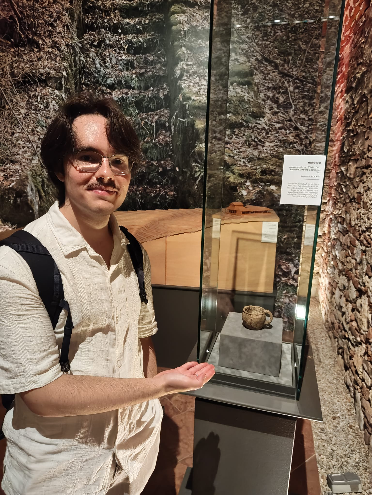

#+title:Buongiorno, sono Gianluca Zavan
#+HTML_HEAD_EXTRA: <link rel="stylesheet" href="https://fonts.googleapis.com/css?family=Honk">

#+BEGIN_EXPORT html
<header>
    
And this is the laziest web page ever (with the flashiest font I found).

</header>
#+END_EXPORT

* About
:PROPERTIES:
:CUSTOM_ID: about
:END:

#+BEGIN_EXPORT html

#+END_EXPORT

#+ATTR_HTML: :id profile-picture

This is me showing you a cup from 3000 BC.

#+BEGIN_EXPORT html

#+END_EXPORT

I'm a PhD student in Symbolic Artificial Intelligence at the
University of Klagenfurt. I'm a former member of [[https://www.madrhacks.org/][MadrHacks]], the
ethical hacking team of the University of Udine.

I graduated with honors at the University of Udine and the University
of Klagenfurt. My thesis, titled "Automated planning for production
routines", was the result of a collaboration with Infineon AG.

My main interests are:

- Artificial Intelligence, both symbolic and sub-symbolic
- Software security
- Programming languages
- Beatboxing
- Videogames
- Tabletop games
- Reading all kinds of stuff
- Music with lots of synths and robot voices (Daft Punk I'm looking at
  you)
- Exiting (Neo)Vim, but Emacs is also my friend now
- Linux, I use Arch btw

You can find me on [[https://github.com/gianzav][Github]] and [[https://it.linkedin.com/in/gianluca-zavan-0a3031293][Linkedin]]. You can send me an
email at =zavan.gianluca[at]outlook.com=.

* Some projects of mine
- [[./aoc2024.html][Advent of code 2024]]: my solutions in CL to some of
  the problems of AOC 2024
- [[./maybe-monad.org][The Maybe monad in Scheme]]
- [[https://github.com/gianzav/ogmready][An Object-Graph Mapper to work with Ontologies in Python]]
- [[https://github.com/gianzav/aco][Haskell implementation of Ant Colony Optimization]]
- [[https://github.com/gianzav/clingo-problems][Modelling of NP-hard problems in Answer Set Programming]]
  

* Things worth a look in the web
:PROPERTIES:
:CUSTOM_ID: things-worth-a-look
:END:
- [[./common-lisp-resources.html][Common Lisp resources]]
- [[https://www.youtube.com/watch?v=OyfBQmvr2Hc&pp=ygUadGhlIG1vc3QgYmVhdXRpZnVsIHByb2dyYW0%3D]["The Most Beautiful Program Ever Written"]] by William Byrd
  - To dive deeper, check [[http://minikanren.org/][miniKanren]]
- [[https://thesephist.com/]]: a nice blog
- [[https://github.com/kanaka/mal?tab=readme-ov-file][Make a Lisp]]
- [[https://protohackers.com/problems]]: something I might do someday (/probably not/)
- [[https://github.com/BartoszMilewski/DaoFP][The Dao of Functional Programming]]
  

** Things that I want to understand

- [[https://blog.sigplan.org/2021/08/12/reflective-towers-of-interpreters/][Reflective Towers of Interpretes]]
- [[https://bartoszmilewski.com/2025/01/04/legalizing-comonad-composition/][This blogpost]]
